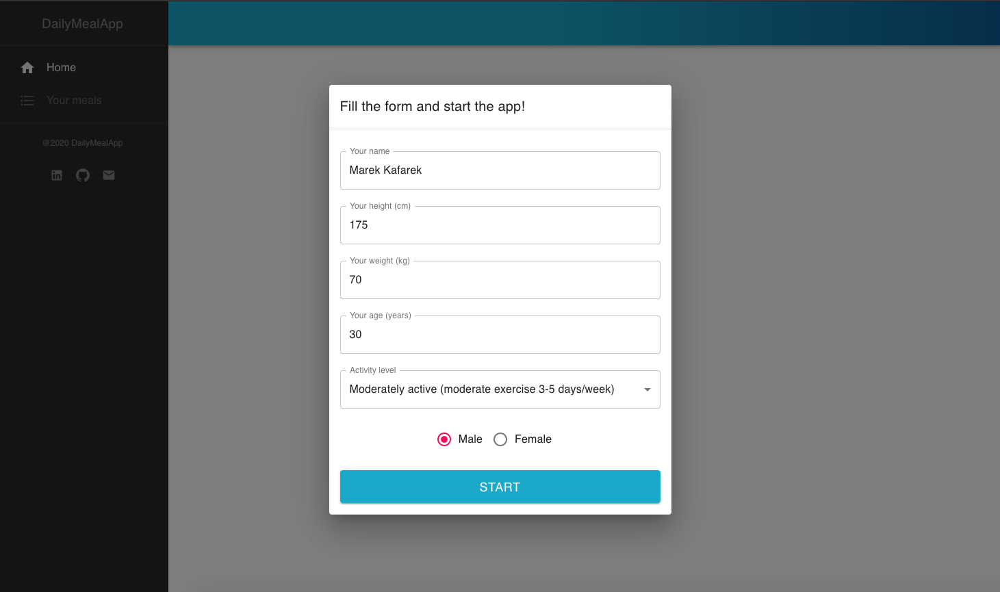
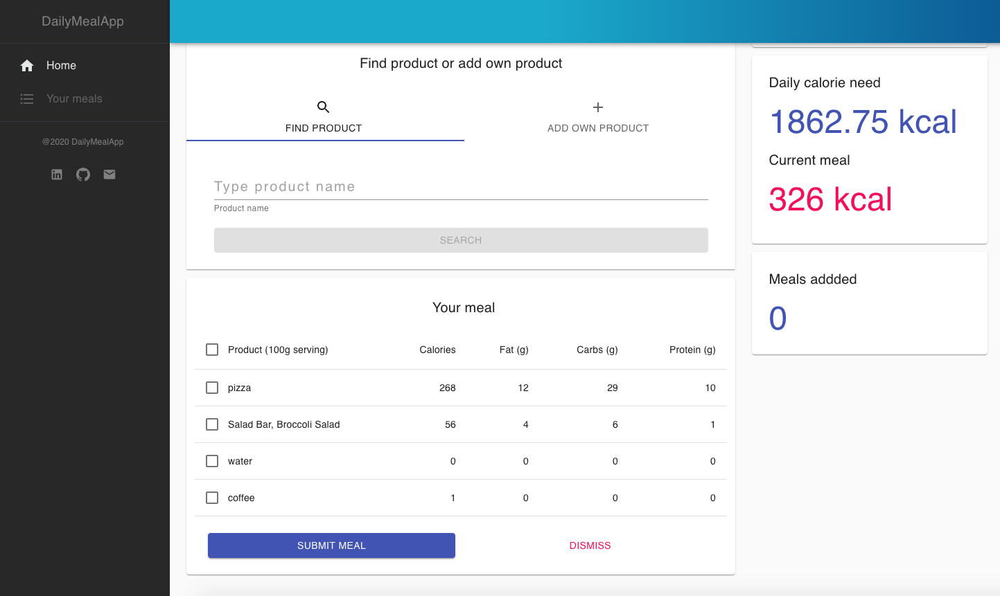

# DailyMealApp

It is an App for storing and fetching info about eaten products during a day.

### Demo :rocket:
[Demo here](https://lukaszrej.github.io/DailyMealApp/)

### Technologies and libraries used

- [React](https://reactjs.org/) (with hooks)
- [Redux](https://redux.js.org/), [Redux-thunk](https://github.com/reduxjs/redux-thunk)
- [TypeScript](https://www.typescriptlang.org/)
- [Chart.js](https://www.chartjs.org/)
- [Material-UI](https://material-ui.com/)
- [Axios](https://github.com/axios/axios)

### Configuration

- Clone the repo and navigate to the main directory
- Install node modules using ```npm i```
- Start React using ```npm start```
- See the project on a browser on the port listed below

#### Configuration

If you would like to configure correctly the project consider following steps
- Create free account on the API provider platform - [Edamam](https://developer.edamam.com/)
- Configure your local environment variables ([learn more](https://create-react-app.dev/docs/adding-custom-environment-variables/))
- You will need your API key and API id from the provider

```sh
http://localhost:3000/
```

#### Preview

##### Initial screen


##### Home page view


##### Typing product in search field


##### List of found products 


##### Selecting and deleting product in a table


##### View after adding products


##### View after adding a meal


##### Meals page view


##### Home page after adding a meal


##### Home page (middle screen device)
")
")

##### Home page (small device)
")

##### Home page (small device)
")

##### Meals page (small device)
")